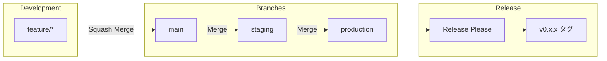

# Python Project Template with uv

[](https://github.com/masakaya/python-uv-project/actions/workflows/test.yml)
[](https://codecov.io/gh/masakaya/python-uv-project)
[](https://github.com/masakaya/python-uv-project/actions/workflows/ruff.yml)
[](https://github.com/masakaya/python-uv-project/actions/workflows/mypy.yml)
[](https://www.python.org/downloads/)

Modern Python プロジェクトテンプレート - 高速パッケージマネージャ `uv` とコード品質ツールの統合

> **📊 カバレッジレポート**: [Codecov](https://codecov.io/gh/masakaya/python-uv-project) で確認できます。各 PR にも自動的にカバレッジレポートがコメントされます。

## 📋 概要

このテンプレートは、Pythonプロジェクトを素早く立ち上げるための最新のベストプラクティスを統合したものです。

### 主な特徴

- ✅ **高速パッケージ管理**: [uv](https://github.com/astral-sh/uv) による爆速の依存関係管理
- ✅ **自動コード品質チェック**: Ruff による linting とフォーマット
- ✅ **静的型チェック**: mypy による型安全性の保証
- ✅ **自動テスト**: pytest + カバレッジレポート
- ✅ **タスクランナー**: Poe the Poet による統一されたコマンド
- ✅ **コミットメッセージ強制**: gitlint による Conventional Commits 検証
- ✅ **自動バージョニング**: release-please による自動リリース管理
- ✅ **ブランチ自動プロモーション**: main → staging → production の自動PR作成
- ✅ **コンフリクト自動解決**: プロモーション時のコンフリクトを自動解決
- ✅ **GitHub Actions 統合**: reviewdog による自動コードレビュー
- ✅ **自動フォーマット**: PR時に自動的にコード整形＋コミット
- ✅ **依存関係自動更新**: Renovate による定期的な依存関係更新

---

## 🚀 クイックスタート

### 前提条件

- Python 3.12+
- [uv](https://github.com/astral-sh/uv) がインストール済み

### セットアップ

```bash
# リポジトリをクローン
git clone <your-repo-url>
cd python-uv-project

# 依存関係をインストール
uv sync --all-groups

# Git hooks をインストール（コミットメッセージ検証用）
poe setup-hooks

# 開発準備完了！
```

---

## 📝 コミットルール（必読）

**このプロジェクトは Conventional Commits を使用した自動バージョニングを採用しています。**

### 必須フォーマット

すべてのコミットメッセージは以下の形式に従う必要があります：

```
<type>: <description>

[optional body]

[optional footer]
```

### タイプと影響

| Type | 説明 | 例 | バージョン影響 |
|------|------|-----|---------------|
| `feat` | 新機能追加 | `feat: add user login` | 0.1.0 → **0.2.0** |
| `fix` | バグ修正 | `fix: resolve memory leak` | 0.1.0 → **0.1.1** |
| `feat!` | 破壊的変更 | `feat!: redesign API` | 0.1.0 → **1.0.0** |
| `chore` | メンテナンス | `chore: update dependencies` | なし |
| `docs` | ドキュメント | `docs: update README` | なし |
| `refactor` | リファクタリング | `refactor: simplify logic` | なし |
| `test` | テスト | `test: add unit tests` | なし |
| `ci` | CI/CD変更 | `ci: add workflow` | なし |

### 自動検証

**gitlint** がコミット時に自動的にメッセージを検証します：

```bash
# ✅ 成功 - 正しいフォーマット
git commit -m "feat: add authentication"
git commit -m "fix: resolve login bug"
git commit -m "docs: update setup guide"

# ❌ 失敗 - 不正なフォーマット
git commit -m "Added feature"        # Type がない
git commit -m "add: new feature"     # 無効な type
git commit -m "feat:add feature"     # コロン後のスペースがない
git commit -m "feat: a"              # description が短すぎる（最低10文字）
```

### 破壊的変更の書き方

```bash
# 方法1: ! を付ける
git commit -m "feat!: remove old API

BREAKING CHANGE: The legacy API has been removed"

# 方法2: BREAKING CHANGE フッター
git commit -m "refactor: change config format

BREAKING CHANGE: Configuration file format changed from JSON to YAML"
```

### なぜ重要か

- **自動バージョニング**: production へのマージ時、コミット履歴から自動的にバージョンを決定
- **CHANGELOG 生成**: コミットメッセージから自動的に CHANGELOG.md を生成
- **リリース管理**: 適切なバージョンで GitHub Release を作成

### トラブルシューティング

```bash
# フックが動作しない場合
poe setup-hooks

# 最後のコミットメッセージを検証
poe validate-commit

# フックを一時的に無効化（非推奨）
git commit --no-verify -m "message"
```

詳細: [Conventional Commits 公式サイト](https://www.conventionalcommits.org/)

---

## 🛠️ 利用可能なツール

### コード品質

| ツール | 用途 | ドキュメント |
|-------|------|-------------|
| **Ruff** | Linting & Formatting | [docs/RUFF.md](docs/RUFF.md) |
| **mypy** | 静的型チェック | [docs/MYPY.md](docs/MYPY.md) |
| **pytest** | テスティング | [docs/TESTING.md](docs/TESTING.md) |
| **Renovate** | 依存関係自動更新 | [docs/RENOVATE.md](docs/RENOVATE.md) |

### タスク管理

**Poe the Poet** - プロジェクト全体で統一されたタスクコマンド

```bash
# 利用可能なタスク一覧
poe

# よく使うコマンド
poe lint         # Ruff linting
poe format       # コードフォーマット
poe typecheck    # 型チェック
poe test         # テスト実行
poe check        # 全チェック実行
```

---

## 📚 ドキュメント

各ツールの詳細な使い方とベストプラクティスは、以下のドキュメントを参照してください：

### Ruff（コード品質）
**[docs/RUFF.md](docs/RUFF.md)**
- Ruffの基本的な使い方
- IDE統合（VSCode、PyCharmなど）
- コマンドライン実行
- GitHub Actions 自動フォーマット
- reviewdog 連携

### mypy（型チェック）
**[docs/MYPY.md](docs/MYPY.md)**
- mypyの概要とメリット
- 型チェックの実行方法
- 型アノテーションの書き方
- 段階的な型導入
- よくあるエラーと対処法
- GitHub Actions 統合

### pytest（テスト）
**[docs/TESTING.md](docs/TESTING.md)**
- テストの書き方
- テスト実行方法
- カバレッジレポート
- マーカーの使い方
- ベストプラクティス

---

## 🤖 GitHub Actions

このテンプレートには7つの自動化ワークフローが含まれています：

### コード品質ワークフロー

| ワークフロー | トリガー | 処理内容 |
|-------------|---------|---------|
| **Ruff** | push/PR | コード品質チェック、自動フォーマット＋コミット |
| **mypy** | push/PR | 型チェック、PRへのエラー指摘 |
| **Test** | push/PR | テスト実行、カバレッジレポート |
| **Renovate** | 毎週土曜 3:00 JST | 依存関係の更新PR作成 |

### ブランチプロモーションワークフロー

| ワークフロー | トリガー | 処理内容 |
|-------------|---------|---------|
| **Promote to Staging** | main へのpush | main → staging の自動PR作成（コンフリクト自動解決） |
| **Promote to Production** | staging へのpush | staging → production の自動PR作成（コンフリクト自動解決） |
| **Release** | production へのpush | リリースPR作成、GitHub Release、タグ作成（v0.x.x形式） |

---

## 💻 開発ワークフロー

### ブランチ戦略



### マージ種別

| ブランチ間 | マージ方法 | 理由 |
|-----------|-----------|------|
| feature → main | **Squash Merge** | 細かいコミットをまとめて履歴をクリーンに |
| main → staging | **Merge** | 機能単位の履歴を保持（Revert可能） |
| staging → production | **Merge** | 機能単位の履歴を保持（Revert可能） |

### 日常的な開発

```bash
# 1. feature ブランチを作成
git checkout -b feat/new-feature main

# 2. コード編集 & コミット
poe check  # lint + format + typecheck + test
git add .
git commit -m "feat: 新機能追加"

# 3. main へ PR 作成 & マージ
git push -u origin feat/new-feature
gh pr create --base main
```

### マージ後の自動フロー

1. **main へマージ** → 自動で `main → staging` のPRが作成される
2. **staging PRをマージ** → 自動で `staging → production` のPRが作成される
3. **production PRをマージ** → Release Please がリリースPRを作成
4. **リリースPRをマージ** → タグ（v0.x.x）とGitHub Releaseが自動作成

**注意**: コミットメッセージは [📝 コミットルール](#-コミットルール必読) に従う必要があります。

---

## 📦 プロジェクト構成

```
.
├── .github/
│   ├── scripts/          # ワークフロー用スクリプト
│   │   ├── ruff-review.sh
│   │   └── mypy-review.sh
│   ├── workflows/        # GitHub Actions
│   │   ├── ruff.yml
│   │   ├── mypy.yml
│   │   ├── test.yml
│   │   ├── promote-to-staging.yml
│   │   ├── promote-to-production.yml
│   │   └── release.yml
│   ├── release-please-config.json
│   └── .release-please-manifest.json
├── docs/                 # ドキュメント
│   ├── RUFF_INTEGRATION.md
│   ├── MYPY.md
│   └── TESTING.md
├── tests/                # テストファイル
├── pyproject.toml        # プロジェクト設定
├── ruff.toml            # Ruff設定
├── uv.lock              # 依存関係ロック
└── README.md            # このファイル
```

---

## 🔧 カスタマイズ

### プロジェクト情報の更新

`pyproject.toml` を編集：

```toml
[project]
name = "your-project-name"
version = "0.1.0"
description = "Your project description"
requires-python = ">=3.12"
```

### Ruffルールの調整

`ruff.toml` を編集してルールをカスタマイズ

### mypy設定の変更

`pyproject.toml` の `[tool.mypy]` セクションで調整

---

## 📝 タスクコマンド一覧

```bash
# Linting
poe lint              # チェックのみ
poe lint-fix          # 自動修正
poe lint-unsafe       # 安全でない修正も実行

# フォーマット
poe format            # フォーマット実行
poe format-check      # チェックのみ

# 型チェック
poe typecheck         # 全体チェック
poe typecheck <file>  # 特定ファイル
poe typecheck-strict  # 厳格モード
poe typecheck-review  # reviewdogで確認

# テスト
poe test              # テスト実行
poe test-cov          # カバレッジ付き
poe test-verbose      # 詳細出力

# reviewdog（ローカル）
poe review-local      # Ruff reviewdog
poe typecheck-review  # mypy reviewdog

# 統合
poe check             # 全チェック
poe fix               # 自動修正可能なもの全て
poe ci                # CI用チェック

# その他
poe clean             # キャッシュ削除
poe install           # 依存関係インストール
poe update            # 依存関係更新
```

---

## 🤝 コントリビューション

このテンプレートの改善提案は Issue または Pull Request でお願いします。

---

## 📄 ライセンス

このテンプレートは自由に使用・改変できます。